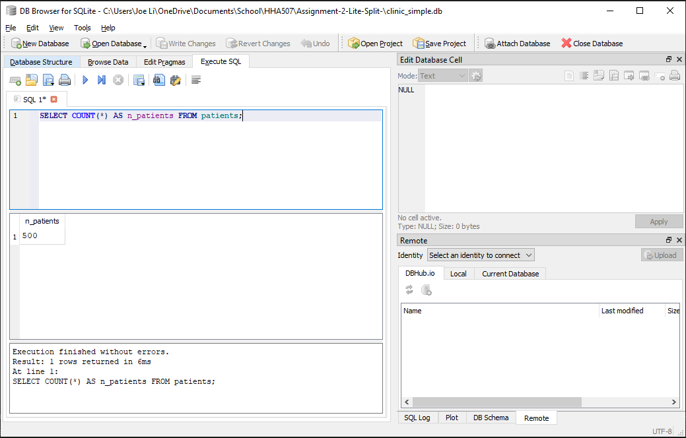
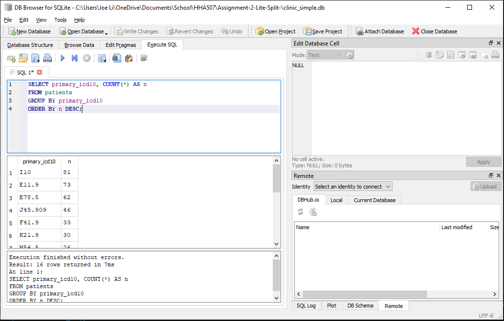
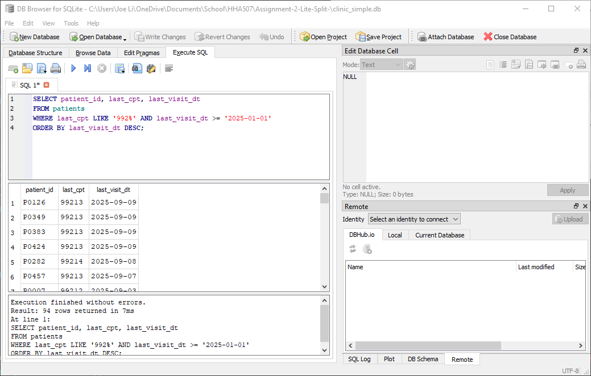
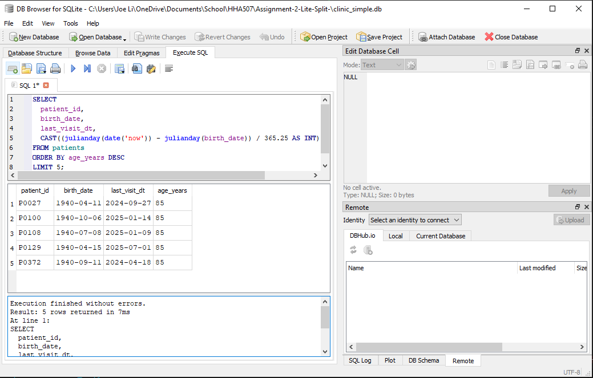
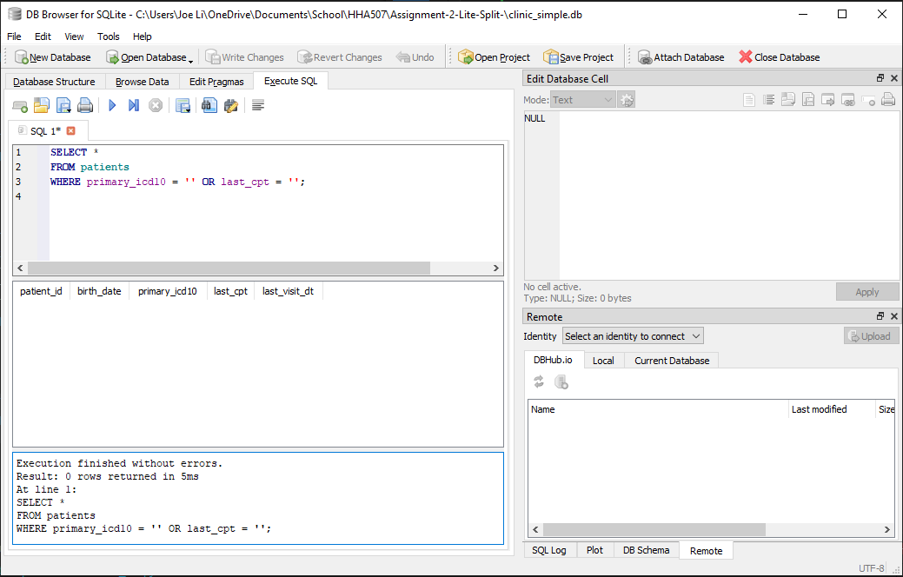

# Assignment-2-Lite-Split-
Single-Table Patient Roster in SQLite

Overview: The goal of this project is to write and run single-table select queries in DB Browswer using SQLite by using Python packages pandas and SQLAlchemy.

Steps:

1. Create a schema sql that outlines the database

2. Write a python code that create a database name 'clinic_simple.db' using the schema sql as blueprint

3. Import a csv files that fits the criteria of the schema

4. Write a python code that reads the csv file and add it to the database that was created

5. Open DB Broswer (SQLite) and upload 'clinic_simple.db'

6. Run the queries.

A- Row count

B- Top primary diagnoses by count

C- Office-visit CPTs since Jan 1, 2025 (CPT codes starting with 992)

D- Age (approx) at last visit for the 5 oldest patients

E- Quick data quality check: any blank codes?
